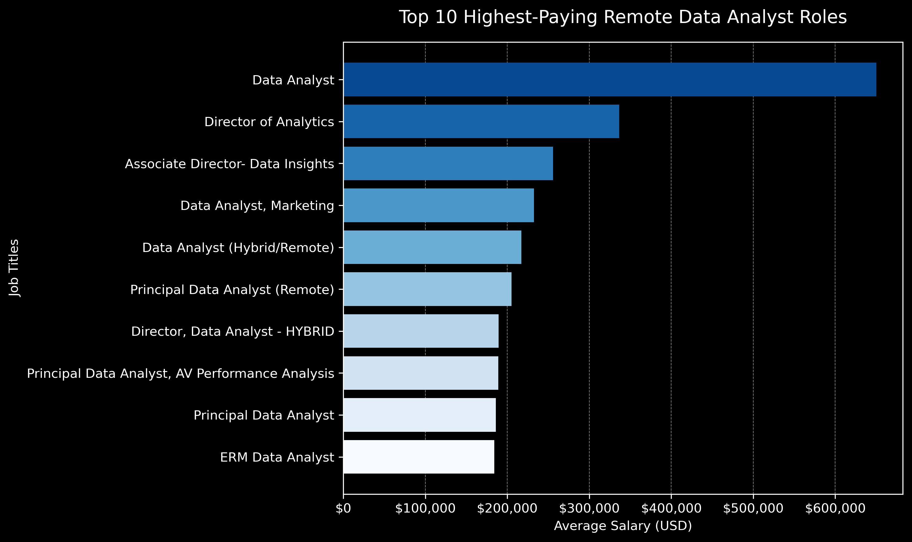
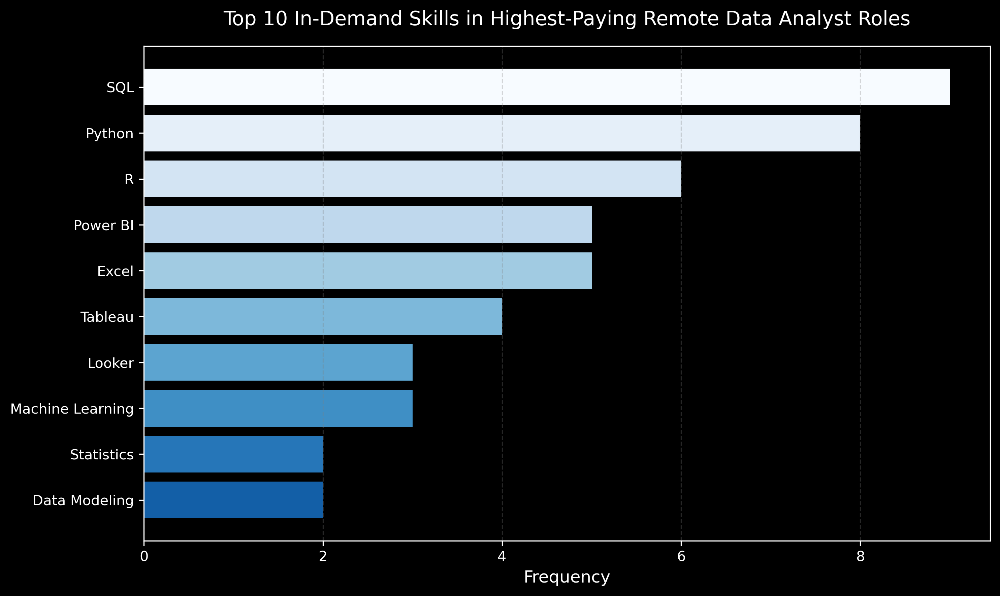
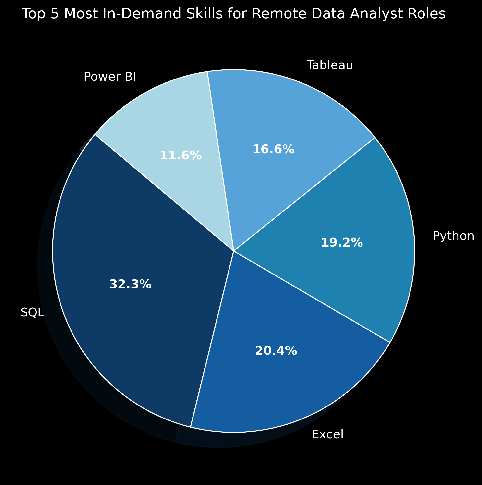

# Data-Career-Deepdive
## 📌 Introduction

📊✨ This project explores thousands of **Data Analyst job postings** to answer key questions:  

💼 What are the **top-paying roles**?  
🧠 What **skills** do they require?  
🔥 What are the **most in-demand tools**?  
💡 And most importantly — what are the **optimal skills to learn** (💸 high-paying + 📈 high-demand)?  

Using real job market data, I’ve uncovered valuable insights to help aspiring and current analysts focus on the right tools, languages, and platforms.  

Whether you're just getting started or planning your next move, this project helps you stay ahead of the curve 🚀🔍📉📈.

SQL queries 👉: [project_sql folder](/project_sql/)


## 🧠 Background

✨ As an aspiring data analyst, I often found myself wondering — **what exactly should I focus on learning to land a high-paying and in-demand role?** With the explosion of tech tools and skills out there, it’s easy to feel overwhelmed. That’s what sparked the idea for this project. I wanted to use real data to guide my learning path and help others like me who are navigating the same journey. 💡

### ❓ Key Questions I Wanted to Answer
- **What are the top-paying data analyst roles?**  

- **What skills are most commonly required for those high-paying roles?**  
- **Which skills are in highest demand for data analyst positions?**  
- **Which skills offer the highest average salaries within the field?**  
- **Which skills are both high-paying *and* in high demand (optimal skills)?**

By answering these questions with data, I aimed to create a roadmap for what to prioritize — not based on guesswork, but grounded in current industry trends 📊✨.

## 🛠️ Tools Used

- **SQL**  
  Structured Query Language (SQL) was essential for querying the dataset. It enabled the extraction, filtering, and aggregation of job-related information to reveal trends in salaries and skill demand.

- **PostgreSQL**  
  PostgreSQL served as the database management system for storing and organizing the job postings. Its robust querying capabilities made it ideal for handling large datasets efficiently.

- **Visual Studio Code (VS Code)**  
  VS Code provided an efficient development environment for writing and managing SQL queries. With the right extensions, it also allowed smooth interaction with the PostgreSQL database.

- **GitHub**  
  GitHub was used for version control and collaboration. It also serves as the platform for showcasing the project, making it accessible to others in the data community.

## 📊 The Analysis

## 1.Top-Paying Roles for Data Analysts

To identify the top-paying roles within the data analytics field, I queried job postings where the role was "Data Analyst", the job location was remote ("Anywhere"), and the salary was specified. Using SQL on a PostgreSQL database, I sorted the roles by highest average annual salary and selected the top 10. This helped uncover the highest-earning job titles, companies, and their compensation figures from thousands of listings.

```sql
SELECT job_id,
    job_title,
    job_location,
    job_schedule_type,
    salary_year_avg,
    job_posted_date,
    name as company_name
FROM job_postings_fact
    LEFT JOIN company_dim on job_postings_fact.company_id = company_dim.company_id
WHERE job_title_short = 'Data Analyst'
    AND job_location = 'Anywhere'
    AND salary_year_avg IS NOT NULL
ORDER BY salary_year_avg DESC
LIMIT 10
```
### 🔑 Key Insights

The results reveal valuable patterns about the top-paying remote data analyst roles:

- **High Salary Range**: Remote data analyst roles offer competitive salaries, ranging from **$184,000** to **$650,000** annually. This highlights the strong demand for skilled data professionals.

- **Broad Role Spectrum**: Job titles span from standard roles like *Data Analyst* to senior-level positions such as *Director of Analytics* and *Principal Data Analyst*, showing a wide variety of opportunities.

- **Diverse Employers**: These top-paying roles come from a range of organizations — from tech giants like **Meta** and **AT&T** to smaller firms like **SmartAsset** and **Mantys** — demonstrating the cross-industry demand for data expertise.


*This chart shows the top 10 highest-paying remote data analyst roles, highlighting job titles and their average salaries.*


## 2. Top Skills for Top Paying Roles
 *The goal is to identify the most frequently required skills across the top 10 highest-paying **remote** data analyst job postings. This insight helps prioritize which tools and technologies are most valued in elite roles and can guide career upskilling decisions.*

```sql
WITH top_paying_jobs AS(
  SELECT job_id,
    job_title,
    salary_year_avg,
    name as company_name
  FROM job_postings_fact
    LEFT JOIN company_dim on job_postings_fact.company_id = company_dim.company_id
  WHERE job_title_short = 'Data Analyst'
    AND job_location = 'Anywhere'
    AND salary_year_avg IS NOT NULL
  ORDER BY salary_year_avg DESC
  LIMIT 10
)
SELECT top_paying_jobs.*,
  skills
FROM top_paying_jobs
  INNER JOIN skills_job_dim on top_paying_jobs.job_id = skills_job_dim.job_id
  INNER JOIN skills_dim on skills_job_dim.skill_id = skills_dim.skill_id
ORDER BY salary_year_avg DESC
```
---

### 🔍 Key Insights

- **SQL** dominates as the most required skill, appearing in nearly every high-paying job—it's foundational.

- **Python** is nearly as prevalent, reinforcing its role as the go-to programming language for analytics and data science.

- **BI Tools like Tableau and Power BI** are in demand, showing the importance of data visualization and communication.

- **Cloud and Big Data tools** such as AWS, Azure, Databricks, and Snowflake are highly sought after in leadership-level roles.

- **Collaboration & Version Control tools** (Git, Jupyter, PowerPoint, Jira, Confluence) appear in several listings, highlighting soft-tech skills.

---


*This chart shows the most frequently mentioned skills across the top 10 highest-paying remote data analyst roles.*


---

## 3. Most in Demand Skills for Data Analyst Roles

This query focuses on identifying the top skills required for remote Data Analyst roles. It filters the job postings to only include remote positions with the job title “Data Analyst” and then counts how often each skill appears. The results help highlight the tools and technologies that employers consistently look for in top-paying remote 
roles.

```sql
SELECT skills,
    COUNT (skills_job_dim.job_id) AS demand_count
FROM job_postings_fact
    INNER JOIN skills_job_dim on job_postings_fact.job_id = skills_job_dim.job_id
    INNER JOIN skills_dim on skills_job_dim.skill_id = skills_dim.skill_id
WHERE job_title_short = 'Data Analyst'
    AND job_work_from_home = True
GROUP BY skills
ORDER BY demand_count DESC
LIMIT 5
```

#### 💡 Key Insights

- **SQL** is the most in-demand skill, appearing in over 7,000 job listings. It’s essential for querying and managing databases.
- **Excel** remains widely used, especially for reporting and handling structured datasets.
- **Python** is highly valued for data analysis, automation, and machine learning tasks.
- **Tableau** and **Power BI** are top visualization tools, showing the importance of presenting data effectively.

---


*This chart illustrates the top 5 most in-demand skills among remote data analyst roles, showing the relative frequency of each skill based on job listings.* 


## 4. Top Skills Based on Salary

*This analysis highlights the top 10 skills associated with the highest average salaries among remote data analyst job postings. It demonstrates how specialized and emerging technologies can lead to significantly higher compensation.*

---

```sql
SELECT skills,
    ROUND (AVG(salary_year_avg), 0) as average_salary
FROM job_postings_fact
    INNER JOIN skills_job_dim on job_postings_fact.job_id = skills_job_dim.job_id
    INNER JOIN skills_dim on skills_job_dim.skill_id = skills_dim.skill_id
WHERE job_title_short = 'Data Analyst'
    AND salary_year_avg IS NOT NULL --    AND job_work_from_home = True
GROUP BY skills
ORDER BY average_salary DESC
LIMIT 25
```
### 💡 Key Insights

- **Highly specialized skills lead the chart**  
  `svn` stands out with an exceptionally high average salary of $400,000, likely due to its use in legacy enterprise systems requiring niche expertise.

- **Blockchain and Web3 technologies pay well**  
  `solidity`, the language for smart contracts, appears second on the list, indicating a strong demand in decentralized finance and blockchain analytics.

- **Emerging data platforms are in demand**  
  Tools like `couchbase` and `datarobot` show how companies leveraging cutting-edge database and AutoML platforms offer high pay to attract talent.

- **Programming languages beyond the basics offer value**  
  `golang` and `mxnet` show that mastering alternative or less common languages can distinguish you and lead to better compensation.

- **Machine learning frameworks dominate**  
  The inclusion of `mxnet`, `keras`, and `pytorch` highlights the continuing rise in demand for data analysts with machine learning capabilities.

---

  ### 🧮 Top 10 High-Paying Skills for Data Analysts

| Skill         | Average Salary (USD) |
|---------------|----------------------|
| svn           | $400,000             |
| solidity      | $179,000             |
| couchbase     | $160,515             |
| datarobot     | $155,486             |
| golang        | $155,000             |
| mxnet         | $149,000             |
| dplyr         | $147,633             |
| vmware        | $147,500             |
| terraform     | $146,734             |
| twilio        | $138,500             |

*These figures represent the average annual salaries associated with each skill in remote data analyst job listings.*


## 5.Most Optimal Skills 
*This analysis focuses on identifying which skills offer both strong demand and high salaries in remote data analyst job postings. By filtering for skills mentioned in more than 10 job listings and where salary data is available, we highlight the tools and technologies that maximize earning potential while maintaining relevance in the job market.*


```sql
SELECT skills_dim.skill_id,
    skills_dim.skills,
    COUNT(skills_job_dim.job_id) AS demand_count,
    ROUND (AVG(job_postings_fact.salary_year_avg), 0) AS avg_salary
FROM job_postings_fact
    INNER JOIN skills_job_dim on job_postings_fact.job_id = skills_job_dim.job_id
    INNER JOIN skills_dim on skills_job_dim.skill_id = skills_dim.skill_id
WHERE job_title_short = 'Data Analyst'
    AND salary_year_avg IS NOT NULL
    AND job_work_from_home = True
GROUP BY skills_dim.skill_id
HAVING COUNT(skills_job_dim.job_id) > 10
ORDER BY avg_salary DESC,
    demand_count DESC
LIMIT 25
```
### 🔍 Key Insights

- 💰 **Go** and **Confluence** are among the highest-paying skills, though less common, suggesting specialized expertise is highly rewarded.
- ☁️ **Cloud tools** like **Azure**, **Snowflake**, **AWS**, and **BigQuery** dominate the top 10, underscoring the importance of cloud infrastructure knowledge.
- 🛠️ A mix of **data engineering**, **analytics**, and **project management tools** (like Jira and SSIS) show that diverse skillsets beyond just coding can boost salary prospects.

*

### 🧮 Top 10 High-Paying In-Demand Skills for Remote Data Analysts

| Skill       | Demand Count | Average Salary (USD) |
|-------------|---------------|-----------------------|
| Go          | 27            | $115,320              |
| Confluence  | 11            | $114,210              |
| Hadoop      | 22            | $113,193              |
| Snowflake   | 37            | $112,948              |
| Azure       | 34            | $111,225              |
| BigQuery    | 13            | $109,654              |
| AWS         | 32            | $108,317              |
| Java        | 17            | $106,906              |
| SSIS        | 12            | $106,683              |
| Jira        | 20            | $104,918              |

---


## 💡 What I Learned


- **Advanced SQL Practice**  
  I strengthened my ability to write efficient SQL queries involving joins, filtering, grouping, and aggregation to extract meaningful insights from large datasets.

- **Data-Driven Decision Making**  
  This project helped me better understand how to analyze job market data to make informed career-related conclusions, especially around in-demand and high-paying skills.

- **Technical Workflow**  
  I improved my workflow using tools like PostgreSQL, VS Code, and GitHub, gaining confidence in managing databases, organizing code, and publishing professional projects.


## ✅ Conclusion

### Insights

- Python, SQL, Excel, Tableau, and Power BI are the most frequently required skills in top-paying remote data analyst roles.
- Python consistently appears in the highest-paying listings, reinforcing its critical value in the data analytics field.
- Cloud platforms like AWS, Azure, and Snowflake dominate the top-paid skill list, indicating a shift toward cloud-based analytics.
- Despite being in high demand, some popular tools like Tableau and Excel appear in relatively lower-paying roles, showing that demand doesn't always equate to high salary.
- Roles that mention niche or engineering-adjacent skills (like Go, Confluence, or Hadoop) tend to command the highest salaries, suggesting cross-functional skills are a competitive advantage.

### Closing Thoughts

This project deepened my understanding of how to interpret job market trends using real-world data. By combining SQL-based querying with clear data visualization and analysis, I was able to uncover the relationship between skill demand and salary. More importantly, I now have a clearer direction on which technical skills to prioritize in my learning journey as a future data analyst.
